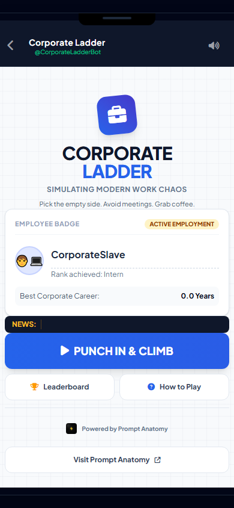

# Corporate Ladder


A fast-paced Telegram Mini App where players climb the corporate ladder while avoiding meetings, reorganizations, and burnout.


**"Lumberjack meets modern office life."**





## Live demo


| Surface | URL |

|---------|-----|

| **Mini App** | https://www.promptanatomy.lol |

| **Telegram bot** | `@CorporateLadderBot` (or your `VITE_BOT_USERNAME`) |

| **API health** | https://ladder-production-642d.up.railway.app/health |


After first deploy, update this table and [DOCS_INDEX.md](DOCS_INDEX.md) with production URLs. *(Live as of 2026-05-31.)*


## How to play


1. Tap **Punch In & Climb** — your first climb tap starts the run.

2. Tap **left** or **right** to climb one rung per tap; pick the **empty** side (avoid obstacles).

3. Grab **coffee** (+25% energy) when you can.

4. Survive as many **Career Years** as possible before HR terminates you.


**Controls:** large tap zones on mobile; arrow keys (← →) in desktop browser. Full rules in the in-app **How to Play** screen.


**Goal:** maximize Career Years and final rank (Intern → Manager at 10y → CEO at 35y). Compete on Daily and Weekly leaderboards.


## Known issues


- API rate limiting is in-memory per Railway replica — see [docs/architecture.md](docs/architecture.md) for multi-replica caveat.

- Production URLs are placeholders until [DEPLOY.md](DEPLOY.md) checklist is complete.


**DITreneris family:** Same documentation and agent practices as [DITreneris/site](https://github.com/DITreneris/site) (Prompt Anatomy). This repo is the Corporate Ladder Telegram game — satirical scope, not ecosystem marketing.


## Source of truth


| File | Purpose |

|------|---------|

| [DOCS_INDEX.md](DOCS_INDEX.md) | Document map and task router for humans and agents |

| [ROADMAP.md](ROADMAP.md) | Status + release train; shipped baseline through v1.8.2; v1.9 after F&F |
| [DESIGN_SYSTEM.md](DESIGN_SYSTEM.md) | Mini-app tokens, utilities, UI guardrails |

| [docs/mvp-scope.md](docs/mvp-scope.md) | v1 in/out, v1.1 deferrals, terminology (inventory → ROADMAP) |

| [docs/archive/README.md](docs/archive/README.md) | Historical prototype + concept v0.1 (not routine audits) |

| [docs/architecture.md](docs/architecture.md) | Stack, data flow, env vars |


## Stack


| Component | Tech | Host |

|-----------|------|------|

| Mini App | TypeScript, Vite, Tailwind | Vercel |

| API | Python, FastAPI | Railway |

| Bot | Python, aiogram | Railway |

| Database | PostgreSQL | Supabase |


## Quick Start


### Prerequisites


- Node.js 20+

- Python 3.12+

- Supabase account

- Telegram bot token ([@BotFather](https://t.me/BotFather))


### Setup


```bash

git clone https://github.com/DITreneris/ladder.git

cd ladder

cp .env.example .env

# Fill in .env at repo root with your credentials

```


All services (API, bot, mini-app) load env vars from the **repo root** `.env`.

Optional sync into service dirs: `.\scripts\setup-env.ps1` (Windows) or `./scripts/setup-env.sh` (Unix).


### Database


Run the migration in Supabase SQL Editor:


```

supabase/migrations/001_initial_schema.sql

```


### Run Locally


```bash

# Terminal 1 — API

cd packages/api

python -m venv .venv

.venv\Scripts\activate        # Windows

pip install -r requirements.txt

uvicorn app.main:app --reload --port 8000


# Terminal 2 — Bot

cd apps/bot

pip install -r requirements.txt

python main.py


# Terminal 3 — Mini App

cd apps/mini-app

npm install

npm run dev

```


Open http://localhost:5173 (outside Telegram, uses localStorage fallback).


### Environment Variables


See [.env.example](.env.example) and [docs/architecture.md](docs/architecture.md).


## Project Structure


```

apps/mini-app/      Frontend (Vite + TS)

apps/bot/           Telegram bot

packages/api/       REST API

supabase/           Database migrations

docs/               MVP scope, architecture

.cursor/            Cursor rules and skills

```


## Deploy


Full checklist: [DEPLOY.md](DEPLOY.md) · Deep reference: [.cursor/skills/mini-app-deploy/SKILL.md](.cursor/skills/mini-app-deploy/SKILL.md)


Preflight and local smoke: `.\scripts\verify-deploy-config.ps1` and `.\scripts\smoke-local.ps1`


## MVP Scope


See [docs/mvp-scope.md](docs/mvp-scope.md) and [ROADMAP.md](ROADMAP.md).


**v1:** Gameplay, Telegram auth, Daily + Weekly leaderboards, share.


**v1.1:** Friends leaderboard, All-time tab, analytics.


## Development


Agents start at [DOCS_INDEX.md](DOCS_INDEX.md).


- [AGENTS.md](AGENTS.md) — guide for AI agents

- [CHANGELOG.md](CHANGELOG.md) — release history (maintained by Changelog Maintainer agent)

- [docs/archive/](docs/archive/README.md) — archived HTML prototype and concept v0.1 (open only for origin research)


## License


Proprietary — see [LICENSE](LICENSE). All rights reserved.


