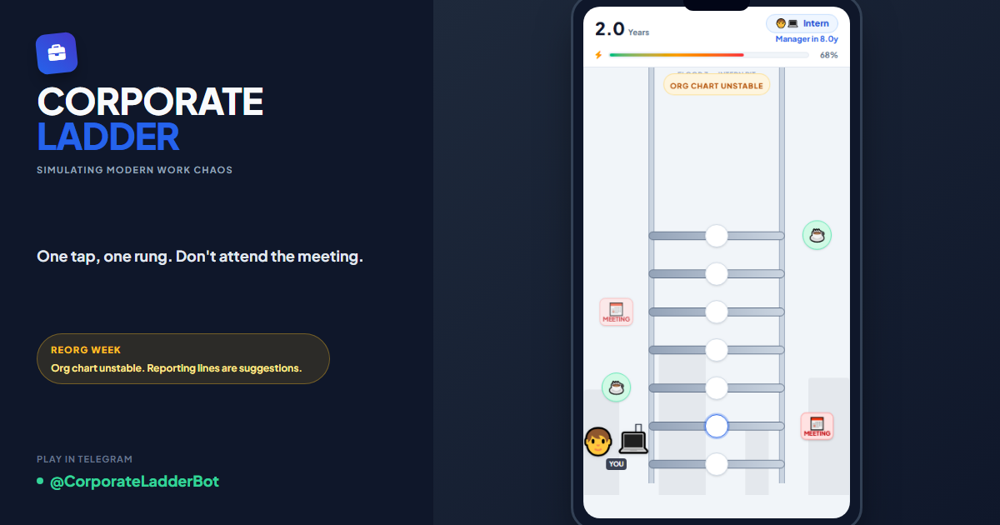

# Corporate Ladder

A fast-paced Telegram Mini App — climb the corporate ladder while avoiding meetings, reorganizations, and burnout.

**"Lumberjack meets modern office life."**



## Live

| Surface | URL |
|---------|-----|
| **Mini App** | https://www.promptanatomy.lol |
| **Bot** | [@CorporateLadder_bot](https://t.me/corporateladder_bot) |
| **API** | https://ladder-production-642d.up.railway.app/health |

## How to play

1. Tap **Punch In & Climb** — first tap starts the run.
2. Tap **left** or **right** for the safe side on the next rung.
3. Grab **coffee** (+25% energy) when you can.
4. Survive as many **Career Years** as possible.

Ranks: Intern → Manager (10y) → Director (20y) → CEO (35y) → Board Member (50y) → Angel Investor (75y). Scores file up to 100y. Daily and Weekly leaderboards.

## Stack

| Component | Tech | Deploy |
|-----------|------|--------|
| Mini App | TypeScript, Vite, Tailwind | Vercel (`apps/mini-app`) |
| API | Python, FastAPI | Railway (`packages/api`) |
| Bot | Python, aiogram | Railway (`apps/bot`) |
| Database | Supabase Postgres | `supabase/migrations/` |

## Local development

```bash
cp .env.example .env   # fill credentials

# API — http://localhost:8000
cd packages/api && pip install -r requirements.txt && uvicorn app.main:app --reload

# Mini App — http://localhost:5173 (set VITE_API_URL=http://localhost:8000)
cd apps/mini-app && npm install && npm run dev

# Bot
cd apps/bot && pip install -r requirements.txt && python main.py
```

## Tests

```bash
cd packages/api && pytest
cd apps/mini-app && npm run lint && npm test && npm run build
```

CI runs the same on push to `main` (`.github/workflows/ci.yml`). See [DEPLOY.md](DEPLOY.md) for production checklist and [SECURITY.md](SECURITY.md) for scanning policy.

## License

Proprietary — see [LICENSE](LICENSE).
