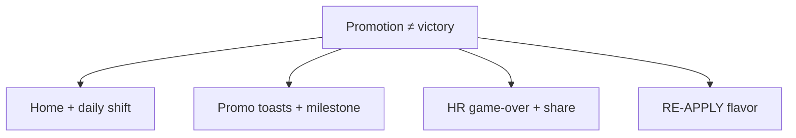

# Roadmap — Corporate Ladder

**Doc map:** [DOCS_INDEX.md](DOCS_INDEX.md) · **Scope:** [docs/mvp-scope.md](docs/mvp-scope.md) · **Ship history:** [CHANGELOG.md](CHANGELOG.md) · **Visual tokens:** [DESIGN_SYSTEM.md](DESIGN_SYSTEM.md) · **Copy tone:** [.cursor/rules/satirical-copy.mdc](.cursor/rules/satirical-copy.mdc) · **Pre-launch audit:** [docs/prelaunch_audit2.md](docs/prelaunch_audit2.md)

**How to use:** Forward-looking working doc — **Status**, active gate, next release leg, and **Shipped baseline** guardrails. Per-release detail lives in [CHANGELOG.md](CHANGELOG.md); do not duplicate CHANGELOG prose here. Historical gates → [docs/archive/ROADMAP_HISTORY.md](docs/archive/ROADMAP_HISTORY.md). Update **Status** when ops change; update **Shipped baseline** when a version is tagged.

**Status vocabulary:** **Live** = merged + prod deploy; **Code complete** = merged, tag/deploy pending; **QA signed** = device checklist complete; **Tagged** = git tag on `origin`; **Planned** = not in code yet.

---

## Status (2026-06-11)

| | |
|---|---|
| **Production** | `main` — deploy **v2.2.0** bundle after push; OG image adopted locally (`npm run adopt:og`) — **Vercel redeploy pending** |
| **Tagged** | `v1.8.5` @ `46abf19` · **`v1.9.0` + `v2.0.0`** on `main` · **`v2.1.0` / `v2.1.1` / `v2.2.0`** tags pending push |
| **F&F verdict** | **CONDITIONAL GO** — pipeline green, retention thin; see [FF_REVIEW_2026-06-14.md](docs/FF_REVIEW_2026-06-14.md) §A/§D |
| **Active** | **v2.2.0** — **Code complete**, tag/deploy pending — no public marketing |
| **Next actions** | Push + Vercel/Railway redeploy · DEVICE_QA v2.0 manual sign-off (iOS + Android) · OG redeploy · re-run `ff-metrics.py` ~1 week post-deploy · [PUBLIC_LAUNCH_REVIEW_2026-06-28.md](docs/PUBLIC_LAUNCH_REVIEW_2026-06-28.md) |
| **Monetization** | **AdsGram rewarded revive** + v2.2 hardening — live with `VITE_ADSGRAM_BLOCK_ID`; no virtual currency / forced interstitials |
| **Acquisition** | **Deferred** — first pilot after public launch GO (~2026-06-28) — [docs/ads-acquisition-plan.md](docs/ads-acquisition-plan.md) |
| **Public launch** | Gated — [PUBLIC_LAUNCH_REVIEW_2026-06-28.md](docs/PUBLIC_LAUNCH_REVIEW_2026-06-28.md) |
| **Pre-launch audit** | **CONDITIONAL GO** (62/100) — [prelaunch_audit2.md](docs/prelaunch_audit2.md) · public launch **NO-GO** until post–v2.2.0 metrics |

### Operational checklist

| Item | Status |
|------|--------|
| [DEVICE_QA_v2.0.md](docs/DEVICE_QA_v2.0.md) rows 1–8 signed (iOS + Android) | [ ] manual — devices (automated smoke: pytest 30 + vitest 117, 2026-06-11) |
| Vercel OG redeploy after `npm run adopt:og` | [x] adopt local 2026-06-11 · [ ] Vercel prod redeploy |
| `python scripts/ff-metrics.py` → `migration_002_ok: true` in prod | [x] 2026-06-11 ([FF_METRICS_2026-06-11](docs/FF_METRICS_2026-06-11.md)) |
| GO verdict filled in [FF_REVIEW_2026-06-14.md](docs/FF_REVIEW_2026-06-14.md) | [x] 2026-06-11 — CONDITIONAL GO |

Runbook: [docs/FF_EXECUTION.md](docs/FF_EXECUTION.md) · Deploy: [DEPLOY.md](DEPLOY.md) · Tracker: [docs/DEPLOY_STATUS.md](docs/DEPLOY_STATUS.md)

---

## Release train (forward only)

| Version | Theme | Status |
|---------|--------|--------|
| **v2.2.0** | Virality + monetization polish (native share, AdsGram hardening, challenge banner, events) | **Code complete** — deploy pending |
| **v2.1.1** | Retention hotfix: tutorial overlay, Energy label, tap pulse, home trim | **Tagged in CHANGELOG** — shipped with v2.2.0 train |
| **v2.1.0** | Retention sprint: Director @ 20y, beat-your-gap, challenge link, rookie ramp, AdsGram, TON analytics, SEO | **Tagged in CHANGELOG** — deploy pending |
| **v2.5.0** | Public launch | **Gated** — [PUBLIC_LAUNCH_REVIEW_2026-06-28.md](docs/PUBLIC_LAUNCH_REVIEW_2026-06-28.md) · audit [prelaunch_audit2.md](docs/prelaunch_audit2.md) |
| **v1.1** | Legends, friends LB, anti-cheat, analytics dashboard | **Deferred** — explicit approval ([mvp-scope](docs/mvp-scope.md)) |

**Older releases (v1.5–v2.0):** per-version detail in [CHANGELOG.md](CHANGELOG.md) only — historical gates in [docs/archive/ROADMAP_HISTORY.md](docs/archive/ROADMAP_HISTORY.md).

---

## Active gate — v2.1.0

Ship checklist (from [CHANGELOG Unreleased](CHANGELOG.md#unreleased)):

| Item | Notes |
|------|--------|
| **Director rank @ 20y** | Intern → Manager @ 10y → **Director @ 20y** → CEO @ 35y; quarterly deadlines (`burnout`) at Director+; desk plants CEO-only; **deploy API with mini-app** |
| **Beat-your-gap home line** | Last shift vs career record on Employee Badge |
| **Share challenge deep link** | `t.me/<bot>?startapp=c_<years×10>`; greet + game-over challenge line |
| **Adaptive rookie ramp** | Gentle Intern spawn through **20 rungs** (0.30 cap) until Manager promo for low career-best players |
| **AdsGram rewarded revive** | Mandatory HR Training on qualifying game-over; score after final death |
| **TON Builders analytics** | `@telegram-apps/analytics`; `VITE_TELEGRAM_ANALYTICS_TOKEN` |
| **SEO / crawler hardening** | Live SEO smoke, sitemap fix, bot/SEO copy alignment |

**Cut ceremony:** lint/test/build · verifier ([.cursor/agents/verifier.md](.cursor/agents/verifier.md)) · `scripts/ff-metrics.py` re-run · tag `v2.1.0` · update this doc **Status** → **Tagged** · `[Unreleased]` → `## [2.1.0]` in CHANGELOG.

---

## Next leg — v2.2.0 (planned)

| Priority | Item |
|----------|------|
| **P0** | Native Telegram share sheet integration |
| **P0** | Production AdsGram hardening (moderation, fallbacks, metrics) |
| **P1** | Challenge home banner (incoming `startapp=c_*`) |
| **P1** | Lightweight event logging (retention/share funnel — not full v1.1 analytics) |
| **P2** | Soft drain cap @ ~20y (DEFER from F&F — revisit if sessions still long) |
| **P2** | Clean-climb streak (copy-only toasts + share line) |
| **P2** | Bot re-engagement nudge after idle |
| **P3** | Daily 3-run quest (copy-only; no currency) |

**Not v2.2:** Friends leaderboard · server anti-cheat replay · Telegram Stars shop · token economy · Phaser/canvas rewrite.

---

## UX audit → release map (2026-06-11)

Jun 2026 UX/UI audit integrated with this release train — full phased plan: **[docs/UX_RETENTION_PLAN.md](docs/UX_RETENTION_PLAN.md)**.  
**Pre-launch product audit #2 (2026-06-11):** **[docs/prelaunch_audit2.md](docs/prelaunch_audit2.md)** — CONDITIONAL GO (62/100); confirms retention-first path before v2.5.0 public launch.

| Audit verdict | Implication |
|---------------|-------------|
| Soft launch / F&F | OK after v2.2.0 deploy + DEVICE_QA |
| Public launch / paid ads | **NO-GO** until external median run ≥30s, share validated, QA signed |
| 7-day plan | Audit §15 — deploy → device QA → ff-metrics → [PUBLIC_LAUNCH_REVIEW](docs/PUBLIC_LAUNCH_REVIEW_2026-06-28.md) |

| Audit priority | Maps to | Notes |
|----------------|---------|-------|
| First-run tutorial, Energy HUD label, tap pulse, home trim, rank explainer | **v2.1.1 hotfix** (post–v2.1.0 tag) | Not in v2.1.0 code complete — highest external retention ROI |
| Director @ 20y home preview copy | **v2.1.0 cut** | Copy-only; align `#homeGameplayPreview` with shipped baseline |
| Beat-your-gap, rookie ramp, challenge link, revive | **v2.1.0** | Already code complete — measure after deploy |
| Native share, challenge banner, AdsGram hardening, events | **v2.2.0** | ROADMAP P0/P1 unchanged |
| Obstacle silhouettes, floor bands, revive A/B | **v2.2.0** or backlog | Clarity over decoration — no mechanic change |
| Soft drain cap, clean-climb streak | **Defer** | ROADMAP backlog + F&F data — do not ship until onboarding fixed |
| Paid acquisition | **v2.5.0 gate ~Jun 28** | [ads-acquisition-plan](docs/ads-acquisition-plan.md) |

**External success metrics** (from F&F): median run ≥30s, ≥6/8 externals with ≥3 runs, validated Telegram share — re-run `python scripts/ff-metrics.py` after v2.1.1.

---

## Product pillars (how work is prioritized)

| Pillar | What it means here | Primary files | Guardrail |
|--------|-------------------|---------------|-----------|
| **Mechanics** | Left/right climb, obstacles, energy, rank gates, spawn fairness | [`engine.ts`](apps/mini-app/src/game/engine.ts), [`constants.ts`](apps/mini-app/src/game/constants.ts) | No new control schemes; rank phases = progression |
| **Graphics** | Emoji-first arena, badges, HUD, contrast, office mood | [`template.ts`](apps/mini-app/src/template.ts), [`app.ts`](apps/mini-app/src/app.ts), [`style.css`](apps/mini-app/src/style.css) | Clarity over decoration; playfield stays readable |
| **Animation** | Tap feedback, telegraphs, death/promo juice, reduced-motion safe | [`effects.ts`](apps/mini-app/src/lib/effects.ts), [`style.css`](apps/mini-app/src/style.css) | 100–200ms micro-motions; no parallax clutter |
| **Satirical view** | HR framing, corporate jargon, shareable failure stories | [`constants.ts`](apps/mini-app/src/game/constants.ts), shell copy, [`apps/bot/main.py`](apps/bot/main.py) | Humor is the product; deadpan, not mean |

**Visual direction (locked):** *Funny cartoon* on a *minimal arcade* playfield — [DESIGN_SYSTEM.md](DESIGN_SYSTEM.md) §1.

---

## Narrative thesis

**Twist:** climbing the ladder is Sisyphean — CEO is not a win state; **RE-APPLY FOR ROLE** is the loop ([`template.ts`](apps/mini-app/src/template.ts)). Plot beats = copy + timing + one visual beat; no new screens required.

---

## Shipped baseline (do not regress)

Single inventory through **v2.1.0**. Per-release prose: [CHANGELOG](CHANGELOG.md). Do not duplicate CHANGELOG here.

### Mechanics

| Item | Notes |
|------|--------|
| Tap left/right, one rung per tap | Core loop; v1.8.5 center corridor visual only |
| Obstacles: Meeting, Reorg, Deadline (`burnout`), Badge gate, Desk plant, Coffee | Rank-gated: Intern → meetings; Manager → +reorgs + gates; **Director+ → deadlines**; **CEO → desk plants** |
| Milestone progression | **Intern @ 0y → Manager @ 10y → Director @ 20y → CEO @ 35y** |
| Scripted tutorial rungs (v1.8.5) | First 3 imminent: clear → meeting RIGHT → coffee LEFT |
| Energy drain + climb/coffee recovery | Pauses until first tap; 2s pause on promotion (v1.6) |
| Intern / rookie ramp | v1.8.4 coffee inject; **v2.1.0 adaptive ramp — 20 rungs, 0.30 cap until Manager** for low career-best |
| Reorg fairness (v1.8.4) | `rungs[1]` frozen during reorg; **Frozen** badge |
| Tap rate limit (v1.8.4) | `MIN_TAP_INTERVAL_MS` 120ms |
| Promotion spawn sync (v1.8.4) | `checkPromotions()` before `generateRung()` |
| Daily modifier + presets (v1.7+) | UTC → preset; five presets incl. Synergy Sprint (v1.9) |
| Synergy Sprint (v1.9) | 60s wall-clock cap; `sprint_mode` on submit |
| Near-miss wince (v1.9) | Safe-side tap past imminent hazard |
| Corporate triage rung (v2.0) | Manager+ ~every 16 rungs — [V2_TRIAGE_SPIKE.md](docs/V2_TRIAGE_SPIKE.md) |
| Background tab fairness (v2.0) | Energy drain pauses while hidden |
| Score plausibility + sprint trust (v2.0) | API caps outliers; validates sprint vs daily preset |
| Director rank + API bands (v2.1.0) | Contiguous Intern/Manager/Director/CEO validation on `/runs` |
| Beat-your-gap + challenge link (v2.1.0) | Home gap line; `startapp=c_*` deep link |
| API rank vs years (v1.8.2+) | Rejects inconsistent `final_rank` vs `years_survived` |

### Graphics

| Item | Notes |
|------|--------|
| Design-system shell, obstacle badges, HUD, game-over card | v1.6+; v1.8.4 clip fixes |
| Today's shift, Reorg Week tint, Meeting Monday reskins | v1.7–v1.8.2 |
| Floor labels, rank props, responsive ladder, single `#gameContentColumn` | v1.8–v1.8.3 |
| Bottom tap deck, compact home, coffee pickup badge, OG/meta | v1.8.2+ |
| Avatar picker, sprint HUD chip, home gameplay preview (v1.9) | F&F UX pack |
| **PA logo footer, sound FAB light theme (v2.1.0)** | Home polish |
| **Director badge / HUD rank (v2.1.0)** | `badge-rank-director` |

### Animation

| Item | Notes |
|------|--------|
| Climb pop, rung advance, reorg telegraph, safe-side hint, death sequence | Core juice; reduced-motion safe |
| Corridor start (v1.8.5), promo stamp, heartbeat SFX (v1.8) | |
| Near-miss wince, in-run BGM from Manager promo, news ticker (v1.9) | Home silent — lounge BGM removed |
| Revive defer on background (v2.1.0) | Score submits on `pagehide` if revive skipped |

### Satire

| Item | Notes |
|------|--------|
| Failure/promotion/retry/share copy packs | constants + `app.ts` |
| Ticker foreshadow, RE-APPLY tiers, shift death flavor, CEO/Director beats | v1.8+; **Director promotion dialogue (v2.1.0)** |
| Tier A shell trim (v2.1.0) | Shorter home/how-to; game-over flavor without outer quotes |
| **Mandatory HR Training revive CTA (v2.1.0)** | AdsGram rewarded |
| SEO/crawler + bot `/start` alignment (v2.1.0) | Dodge meetings / org chart voice |

### Platform

| Item | Notes |
|------|--------|
| Telegram auth, Daily + Weekly leaderboards, share, bot `/start` `/go` `/help` | Core MVP |
| Session token auth + `POST /leaderboard/me` highlight (v2.0) | No initData on LB GET |
| Submit cooldown + session token prune (v2.0) | Supabase `002` |
| Leaderboard fetch window **2000 runs (v2.1.0)** | Before best-per-user aggregation |
| **AdsGram rewarded revive (v2.1.0)** | `VITE_ADSGRAM_*` |
| **TON Builders analytics (v2.1.0)** | `corporate_ladder` app name |
| **Live SEO smoke + GSC sitemap fix (v2.1.0)** | CI `verify:seo:live` |
| **ff-metrics** migration probe + deep analytics (v2.1.0) | `migration_002_ok` |

**Daily shift presets (UTC):** Standard · Meeting Monday · Coffee Break · Reorg Week · Synergy Sprint — labels in [`daily-modifier.ts`](apps/mini-app/src/game/daily-modifier.ts).

---

## Backlog (data-informed)

Build when metrics or v2.2 planning justify — not active gate.

| Item | Pillars | Status |
|------|---------|--------|
| Dynamic audio layering | Animation | Open |
| Shift-specific retry tips | Satire | Open |
| Server-seeded daily + modifier LB | Mechanics + platform | Open — needs DAU threshold |
| Full level select / campaign map | All | **Avoid** unless product pivot |
| Soft drain cap @ ~20y | Mechanics | **DEFER** — [FF_REVIEW](docs/FF_REVIEW_2026-06-14.md) |
| Clean-climb streak | Satire + retention | **DEFER** — FF_REVIEW |
| CEO-only deadline threshold @ 35y | Mechanics | **SUPERSEDED** by Director @ 20y |

Adopted into v2.1.0 (no longer backlog): beat-your-gap, share challenge link, adaptive rookie ramp, single Director rank step.

Research archive (F&F decision tree, gap table, adoption map): [docs/archive/ROADMAP_HISTORY.md](docs/archive/ROADMAP_HISTORY.md).

---

## v1.1 — Platform (deferred — explicit approval)

From [docs/mvp-scope.md](docs/mvp-scope.md):

- All-time / Legends leaderboard tab
- Friends leaderboard
- Server-side replay validation (anti-cheat)
- Product analytics dashboard / custom event pipeline (not TON Builders SDK alone)
- Admin dashboard

---

## Explicitly out of scope

Per [docs/mvp-scope.md](docs/mvp-scope.md) — do not slip in without product decision:

- Virtual currency, skins shop, clans, quests, NFTs
- Complex rank tree (VP, C-suite steps, …) — **scope exception:** single **Director** @ 20y for v2.1.0 only; Intern / Manager / Director / CEO is the cap
- New obstacle logic (both sides lethal, moving hazards, hold-to-dodge) — except v2.0 triage thesis
- Separate antagonist AI / combat
- Heavy parallax or full arena redesign
- Breaking fourth wall — per [satirical-copy.mdc](.cursor/rules/satirical-copy.mdc)
- Random negative coffee / decaf trap
- Telegram Stars shop, token economy, Phaser rewrite (see v2.2 exclusions)

---

## Pillar checklist for any future task

1. **Mechanics** — Left/right clarity and fair telegraphs?
2. **Graphics** — Next rung readable on mobile at a glance?
3. **Animation** — &lt;200ms, optional under reduced motion?
4. **Satire** — HR/bureaucracy voice, not generic game over?
5. **Narrative** — Subverts corporate expectation without new screens?

If any answer is no, cut scope or defer.

---

## Related docs

| Doc | Use when |
|-----|----------|
| [docs/mvp-scope.md](docs/mvp-scope.md) | In/out boundaries and v1.1 deferrals |
| [docs/archive/ROADMAP_HISTORY.md](docs/archive/ROADMAP_HISTORY.md) | Historical gates v1.8.x, F&F research, release archive |
| [docs/archive/README.md](docs/archive/README.md) | v0.1 prototype archive |
| [DESIGN_SYSTEM.md](DESIGN_SYSTEM.md) | Shell tokens and utilities |
| [CHANGELOG.md](CHANGELOG.md) | Per-release shipped detail |
| [docs/FF_EXECUTION.md](docs/FF_EXECUTION.md) | F&F runbook |
| [docs/ads-acquisition-plan.md](docs/ads-acquisition-plan.md) | Acquisition vs in-app AdsGram |
| [docs/UX_RETENTION_PLAN.md](docs/UX_RETENTION_PLAN.md) | UX audit phased plan mapped to release train |
| [docs/prelaunch_audit2.md](docs/prelaunch_audit2.md) | Pre-launch GO/NO-GO audit #2 — retention, virality, 7-day plan |
| [docs/PUBLIC_LAUNCH_REVIEW_2026-06-28.md](docs/PUBLIC_LAUNCH_REVIEW_2026-06-28.md) | Public launch gate checklist (~Jun 28) |
| [.cursor/agents/verifier.md](.cursor/agents/verifier.md) | Pre-tag QA |
