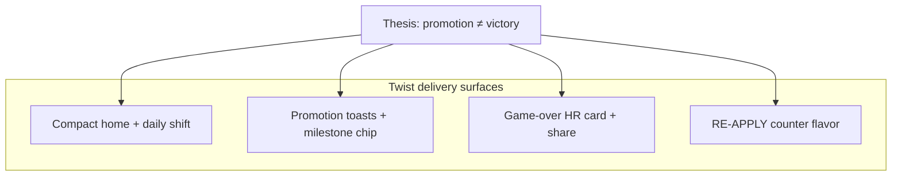
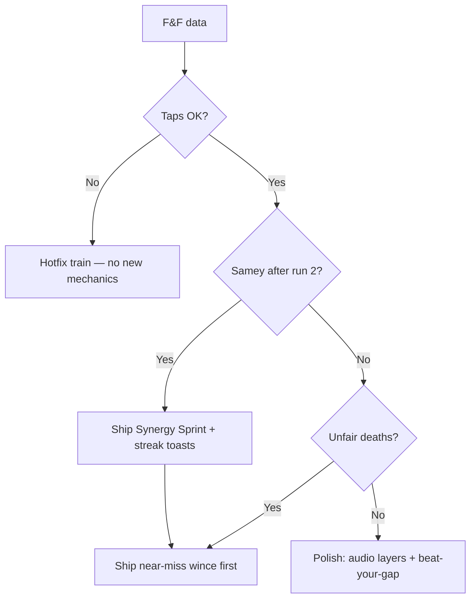

# Roadmap — Corporate Ladder

**Doc map:** [DOCS_INDEX.md](DOCS_INDEX.md) · **Scope:** [docs/mvp-scope.md](docs/mvp-scope.md) · **Ship history:** [CHANGELOG.md](CHANGELOG.md) · **Visual tokens:** [DESIGN_SYSTEM.md](DESIGN_SYSTEM.md) · **Copy tone:** [.cursor/rules/satirical-copy.mdc](.cursor/rules/satirical-copy.mdc)

This roadmap is organized around four product pillars — **mechanics**, **graphics**, **animation**, and **satirical voice** — not feature lists alone. Each release should move at least one pillar forward without breaking the Lumberjack-style core loop (see § Shipped baseline — Mechanics).

**Status vocabulary:** **Live** = merged + prod deploy; **QA signed** = [DEVICE_QA](docs/DEVICE_QA_v1.8.2.md) checklists complete; **Tagged** = git tag on `origin`; **Planned** = not in code yet.

---

## Status (2026-06-01)

| | |
|---|---|
| **Production** | `main` — **v1.8.5 code done**; Vercel redeploy pending |
| **Blocking F&F** | Deploy v1.8.5 → device QA iOS + Android → tag → F&F ([FF_EXECUTION](docs/FF_EXECUTION.md)) |
| **Next actions** | See [v1.8.5 gate — open items](#v185-gate--open-items) below |
| **Next product** | v1.9 provisional — confirm at F&F review **2026-06-14** |

Runbook: [docs/FF_EXECUTION.md](docs/FF_EXECUTION.md) · Deploy steps: [DEPLOY.md](DEPLOY.md) · Tracker: [docs/DEPLOY_STATUS.md](docs/DEPLOY_STATUS.md)

---

## v1.8.5 gate — open items

**Code shipped in repo** — [CHANGELOG 1.8.5](CHANGELOG.md#185---2026-06-01). **Not done yet:**

**Full bug-fix backlog:** [docs/todo.md](docs/todo.md) (P0–P3, verification matrix, tests).

### Operations (blocking F&F)

| # | Item | Owner / notes |
|---|------|----------------|
| 1 | **Push `main`** (if local commits not on origin) | GitHub |
| 2 | **Vercel redeploy** mini-app | Prod must serve v1.8.5 bundle |
| 3 | **Telegram cache bust** | Hard refresh / reopen from bot after deploy |
| 4 | **Device QA** iOS + Android | [DEVICE_QA_v1.8.5](docs/DEVICE_QA_v1.8.5.md) + prior deltas as needed |
| 5 | **Verifier** pass | [.cursor/agents/verifier.md](.cursor/agents/verifier.md) |
| 6 | **`git tag v1.8.5`** + push tags | After device QA sign-off |
| 7 | **F&F window** | [FF_EXECUTION](docs/FF_EXECUTION.md) Phase D |

---

## v1.8.4 gate — open items (superseded by 1.8.5 deploy)

From integrated bug/layout analysis (2026-06-01 chat). **Code shipped in repo** — [CHANGELOG 1.8.4](CHANGELOG.md#184---2026-06-01). **Fold into 1.8.5 deploy if 1.8.4 never tagged:**

### Operations (blocking F&F)

| # | Item | Owner / notes |
|---|------|----------------|
| 1 | **Push `main`** (if local commits not on origin) | GitHub |
| 2 | **Vercel redeploy** mini-app | Prod must not serve `main-BO_qJQT_.js` (v1.8.2); verify new bundle hash on https://www.promptanatomy.lol |
| 3 | **Telegram cache bust** | Hard refresh / reopen from bot after deploy |
| 4 | **Device QA** iOS + Android | [DEVICE_QA_v1.8.1](docs/DEVICE_QA_v1.8.1.md) + [DEVICE_QA_v1.8.2](docs/DEVICE_QA_v1.8.2.md) + [DEVICE_QA_v1.8.4](docs/DEVICE_QA_v1.8.4.md) |
| 5 | **Verifier** pass | [.cursor/agents/verifier.md](.cursor/agents/verifier.md) before tag |
| 6 | **`git tag v1.8.4`** + push tags | After device QA sign-off |
| 7 | **F&F window** | [FF_EXECUTION](docs/FF_EXECUTION.md) Phase D — invite testers |

**Optional tags (never cut):** `v1.8.2`, `v1.8.3` if you want CHANGELOG anchors on origin; F&F gate is **v1.8.4 live + QA**.

### Shipped in v1.8.4 (do not re-open unless regression)

| Area | Fix |
|------|-----|
| Layout | REJECTED stamp clip; HUD rank/milestone stack; play-area player/hint clip; viewport QA clip checks |
| Mechanics | Tutorial coffee inject on `rungs[2]` (retry to rung 12); promotion before `generateRung()`; tap cooldown 120ms |
| UX | Imminent reorg → **Frozen** badge (no shuffle telegraph on `rungs[1]`); reorg retry tip updated |
| v1.8.3 (included) | `#gameContentColumn` single width; coffee clear on pickup |

### Deferred — not v1.8.4 (track in v1.9+)

| Item | Why deferred | Target |
|------|----------------|--------|
| Fixed timestep drain/reorg | Background-tab unfair timing; engineering | [v1.9+ backlog](#v19-backlog-data-informed) |
| Near-miss wince | New animation + callback | [v1.9.0](#v190--near-miss-wince--synergy-sprint-provisional) |
| Synergy Sprint preset | New daily/run mode | v1.9.0 |
| Soft drain cap @ ~20y | Session length tuning | v1.9.0 stretch |
| Clean-climb streak | Copy-only retention | v1.9.0 stretch |
| Server anti-cheat / max rungs/sec | API v1.1 scope | [v1.1](#v11--platform-deferred--explicit-approval) |
| Home “four band” visual unify | Cosmetic; same gutter already — only if device QA still feels broken | v1.9+ polish |
| `pickObstacleType` RNG filter-first | Internal balance cleanup | v1.9+ optional |
| API pytest local env | `tests.conftest` import on some Windows setups; CI may differ | Dev hygiene |

---

## Product pillars (how work is prioritized)

| Pillar | What it means here | Primary files | Guardrail |
|--------|-------------------|---------------|-----------|
| **Mechanics** | Left/right climb, obstacles, energy, rank gates, spawn fairness | [`engine.ts`](apps/mini-app/src/game/engine.ts), [`constants.ts`](apps/mini-app/src/game/constants.ts) | No new control schemes; rank phases = progression |
| **Graphics** | Emoji-first arena, badges, HUD, contrast, office mood | [`template.ts`](apps/mini-app/src/template.ts), [`app.ts`](apps/mini-app/src/app.ts), [`style.css`](apps/mini-app/src/style.css) | Clarity over decoration; playfield stays readable |
| **Animation** | Tap feedback, telegraphs, death/promo juice, reduced-motion safe | [`effects.ts`](apps/mini-app/src/lib/effects.ts), [`style.css`](apps/mini-app/src/style.css) | 100–200ms micro-motions; no parallax clutter |
| **Satirical view** | HR framing, corporate jargon, shareable failure stories | [`constants.ts`](apps/mini-app/src/game/constants.ts), shell copy, [`apps/bot/main.py`](apps/bot/main.py) | Humor is the product; deadpan, not mean |

**Visual direction (locked):** *Funny cartoon* discipline on a *minimal arcade* playfield — sticker-like badges, emoji actor, office grid; satire in shell and game-over, clarity in the climb zone ([DESIGN_SYSTEM.md](DESIGN_SYSTEM.md) §1).

---

## Narrative thesis (plot beats without scope creep)

Corporate Ladder's core twist: **climbing the ladder is Sisyphean** — CEO is not a win state; **RE-APPLY FOR ROLE** is the real loop ([`template.ts`](apps/mini-app/src/template.ts)). Promotion subverts expectation; failure is an HR process, not generic game over.

**Delivery surfaces** (no new screens required):



**Implementation rule:** plot beats = **copy + timing + one visual beat**. Defer character systems to v1.9+ unless retention data says otherwise.

---

## Release train

| Version | Theme | Status | Gate |
|---------|--------|--------|------|
| **v1.5.0–v1.7.0** | Design, fairness, daily replays | **Tagged** · **Live** | [CHANGELOG](CHANGELOG.md#170---2026-05-31) |
| **v1.8.0** | Narrative beats + arena identity | **Tagged** · **Live** | [CHANGELOG](CHANGELOG.md#180---2026-05-31) |
| **v1.8.1** | Telegram mobile + playability polish | **Live** | [CHANGELOG](CHANGELOG.md#181---2026-05-31); device QA folded into v1.8.2 sign-off |
| **v1.8.2** | F&F-ready bundle (mobile UX + trust + discoverability) | **Live** — **QA + tag pending** | [DEVICE_QA_v1.8.2](docs/DEVICE_QA_v1.8.2.md) → tag `v1.8.2` (optional if superseded by 1.8.4) |
| **v1.8.3** | Shared content column + coffee pickup clear | **Code** · deploy folded into 1.8.4 | [CHANGELOG 1.8.3](CHANGELOG.md#183---2026-06-01) |
| **v1.8.4** | Pre-F&F hotfix: layout clip + tutorial coffee + promotion spawn + tap cooldown + imminent reorg UX | **Code** · folded into 1.8.5 deploy | [CHANGELOG 1.8.4](CHANGELOG.md#184---2026-06-01) |
| **v1.8.5** | Corridor UX + scripted tutorial + badge gate / desk plant hazards | **Code done** · **Deploy + QA pending** | [Gate checklist](#v185-gate--open-items) → tag `v1.8.5` |
| **v1.9.0** | Near-miss wince + Synergy Sprint (provisional) | **Planned** | F&F review ~2026-06-14 — [FF_TEST.md](docs/FF_TEST.md) |
| **v1.9+** | Data-informed juice | **Backlog** | After F&F metrics |
| **v1.1** | Platform (Legends, analytics, anti-cheat) | **Deferred** | Explicit approval — [mvp-scope](docs/mvp-scope.md) |

---

## Shipped baseline (v1.5 → v1.8.5)

Inventory by pillar — do not regress without spec update. Per-release detail: [CHANGELOG](CHANGELOG.md) `1.5.0`–`1.8.5`.

### Mechanics

| Item | Notes |
|------|--------|
| Tap left/right, one rung per tap | Core loop unchanged; **v1.8.5** center corridor visual only (no center tap) |
| Obstacles: Meeting, Reorg, Deadline (`burnout`), Badge gate, Desk plant + Coffee | Rank-gated: Intern → meetings; Manager → +reorgs + gates; CEO → +deadlines + plants |
| Scripted tutorial rungs (v1.8.5) | First 3 imminent rungs: clear → meeting RIGHT → coffee LEFT |
| Energy drain + climb/coffee recovery | Pauses until first tap; 2s pause on promotion (v1.6) |
| Intern tutorial ramp | 22% obstacle rate first 12 rungs; forced coffee inject on `rungs[2]` by rung 8 if none collected (v1.8.4) |
| Reorg fairness | Next rung (`rungs[1]`) does not swap during reorg ticks; imminent reorg shows **Frozen** badge (v1.8.4) |
| Tap rate limit (v1.8.4) | `MIN_TAP_INTERVAL_MS` 120ms — prevents energy exploit from tap spam |
| Promotion spawn sync (v1.8.4) | `checkPromotions()` before `generateRung()` — rank-gated obstacles on promotion rung |
| Milestone progression | Intern @ 0y → Manager @ 10y → CEO @ 35y |
| Daily modifier resolver (v1.7) | UTC date → preset via [`daily-modifier.ts`](apps/mini-app/src/game/daily-modifier.ts) |
| Spawn weight overrides (v1.7) | 4 presets; engine reads `dailyModifier` |
| Reorg Week early reorg (v1.7) | `allowEarlyReorg`; fairness on `rungs[1]` unchanged |
| API rank vs years validation (v1.8.2) | `/runs` rejects inconsistent `final_rank` vs `years_survived` |

### Graphics

| Item | Notes |
|------|--------|
| Design-system shell | `btn-cl-*`, `card-light`, rank badges, Telegram `--cl-*` theme |
| Obstacle badges | Color-coded: red meeting, amber reorg, red deadline (v1.6 contrast) |
| HUD | Longevity, rank pill, energy meter, **milestone chip** (v1.6) |
| Game-over card | Performance review layout, REJECTED stamp, death cause row (v1.6) |
| Climb arena | Office grid, skyline silhouettes, ladder rails — intentionally minimal |
| Today's shift badge (v1.7) | [`template.ts`](apps/mini-app/src/template.ts) `#dailyShiftBlock` |
| Reorg Week grid tint (v1.7) | `office-grid-reorg-week` via `gridTintClass` |
| Meeting Monday reskins (v1.7) | Reply-All / Standup badges — deterministic by rung id (v1.8.2) |
| Floor labels (v1.8) | Years band → office floor name on ladder rail |
| Rank props (v1.8) | Intern lanyard / Manager clipboard / CEO monocle on player |
| Reorg HUD strip (v1.8) | `ORG CHART UNSTABLE` amber bar when reorgs active |
| Game-over LB gap (v1.8) | `#leaderboardGapLine` — daily top vs current run |
| Responsive ladder (v1.8.2) | `#ladderTrack` fills content column (no narrow `w-48` dead zones) |
| Single game content column (v1.8.3+) | `#gameContentColumn` wraps HUD + play + tap deck — one gutter width |
| Game-over stamp (v1.8.4) | REJECTED fully visible inside performance card |
| HUD rank stack (v1.8.4) | Rank + milestone stacked; truncate on narrow viewports |
| Play-area inset (v1.8.4) | Climber clamp + horizontal padding — no sprite/hint clip |
| Bottom tap deck (v1.8.2) | Visible h-28 TAP LEFT / TAP RIGHT in `#tapControlsBar` (snippet-style; no play-area overlay) |
| Dynamic rung scaling (v1.8.1+) | All 7 rungs fit inside play area |
| Compact home (v1.8.2) | Amber news strip, shift description, Employee Badge, rule line, hero fade |
| Telegram native shell (v1.8.1) | Hide duplicate header; `BackButton`; sound FAB; safe-area padding |
| Home scroll (v1.8.2) | `#startScreen` scrolls on short Telegram viewports |
| Coffee pickup badge (v1.8.2) | ☕ **+25%** card on next rung; green pulse |
| OG / link preview (v1.8.2) | `public/og.png`, meta tags, `noindex` — Phase 0 discoverability |

### Animation

| Item | File / class | Purpose |
|------|--------------|---------|
| Climb pop | `climb-pop` | Tap confirmation |
| Rung advance | `rung-advance` | Upward progress |
| Reorg slide + telegraph | `reorg-slide-*`, `reorg-warning` | Fairness feedback |
| Safe-side hint (5 taps) | `safe-side-hint` | Onboarding (extended v1.8.1) |
| Deck-first HUD hint (v1.8.2) | `#hudTapHint`, `.tap-deck-hint` | First-run guidance (replaces tap-prompt bar — removed in 1.8.2) |
| Corridor start (v1.8.5) | `#playerClimber.player-at-corridor`, `.rung-center--corridor` | Center aisle before first tap; 2-tap control unchanged |
| Next-rung warn | `next-obstacle-warn` | Threat read |
| Panic / stress | `player-panic`, `burnout-stress` | Low energy |
| Coffee / promo particles | `float-particle`, `promo-confetti` | Reward beats |
| Death sequence | `death-flash`, `shake-finite`, death emoji flash | Failure punch |
| Character micro-states | `idle-bob`, emoji flashes 🤤/😎 (v1.6) | Personality |
| Tap zone glow | `tap-zone-left/right:active` (v1.6) | Control feel |
| Reduced motion | `@media (prefers-reduced-motion: reduce)` | A11y |
| Shift badge entrance (v1.7) | `shift-badge-enter` | Home mount |
| Ticker emphasis (v1.7) | `ticker-shift-emphasis` | Non-standard shift days |
| Promo stamp (v1.8) | `promo-stamp` on promo overlay | Promotion beat |
| Death cause icon hold (v1.8) | `effects.ts` | Game-over punch |
| Heartbeat SFX (v1.8) | `audio.ts` under 15% energy | Low-energy tension |

### Satirical view

| Surface | Implementation |
|---------|----------------|
| Failure flavor | `FAILURE_REASONS`, `FAILURE_BY_RANK` in constants |
| Promotion dialogue | `PROMOTION_DIALOGUES` + overlay + toasts |
| Game-over framing | HR exit interview, termination detail + flavor quote |
| Retry tips | `RETRY_TIPS` by `deathType` (v1.6) — actionable + deadpan |
| Share text | Performance review block in `app.ts` |
| Ticker foreshadow pool (v1.8) | Home news strip; `NEWS_TICKER_HEADLINES` + 20% game-over payoff |
| RE-APPLY counter flavor (v1.8) | `REAPPLY_FLAVOR` tiers in `localStorage` |
| Manager nemesis line (v1.8) | VP of People Ops on Manager promotion |
| Intern fake-promo chain (v1.8) | Toasts at ~2y / ~5y / ~9.9y |
| Shift death flavor (v1.8) | `FAILURE_BY_SHIFT` per daily preset |
| CEO trap beat (v1.8) | Corner-office announcement on **first deadline** (v1.8.2 timing) |
| Employee badge | ACTIVE EMPLOYMENT, nickname, best career years |
| Shift labels + descriptions (v1.7) | Per preset in `daily-modifier.ts` |
| Share `Shift:` line (v1.7) | [`buildShareText`](apps/mini-app/src/app.ts) |
| In-run HR memo rail (v1.8.2) | People Ops / HR Systems below HUD; combined memos; mute via memo not toast |
| Leaderboard empty state (v1.8.2) | Satirical copy when no runs; weekly tab **Last 7 Days** |
| Trust UX (v1.8.2) | Score-submit toasts; auth degradation banner; share toast wording |

**Daily shift presets (rotate by UTC date):**

| Preset | Mechanic tweak | Satirical label |
|--------|----------------|-----------------|
| Standard | Default weights | Open Floor Plan |
| Meeting Monday | Higher meeting spawn weight | Meeting Monday |
| Coffee Break | Higher coffee spawn weight | Coffee Break |
| Reorg Week | Reorgs can appear before Manager rank | Reorg Week |

---

## Current gate — v1.8.2 (F&F-ready)

**Goal:** Close mobile UX + trust gaps before friends-and-family — no new mechanics, screens, or API. Scope matches [CHANGELOG 1.8.2](CHANGELOG.md#182---2026-06-01).

| Step | Status |
|------|--------|
| `npm run lint && npm test && npm run build`; `npm run qa:viewport` | [x] 2026-06-01 |
| Production redeploy (`main` → `d862c3c`) | [x] Vercel + Railway API |
| Cut `## [1.8.2]` in CHANGELOG | [x] |
| Device QA: v1.8.1 regression + [DEVICE_QA_v1.8.2](docs/DEVICE_QA_v1.8.2.md) on iOS + Android | [ ] |
| Verifier (automated + prod smoke) | [ ] after device QA |
| Tag `v1.8.2` on `origin` | [ ] after device QA |

```powershell
git tag -a v1.8.2 -m "v1.8.2 — F&F-ready bundle (mobile UX + trust + discoverability)"
git push origin --tags
```

**Friends-and-family:** 2-week window **2026-05-31 → 2026-06-14** — start after device QA. Full phases: [docs/FF_EXECUTION.md](docs/FF_EXECUTION.md) · metrics: [docs/FF_TEST.md](docs/FF_TEST.md).

**Discoverability:** Telegram-first (bot + shares). Phase 0 OG/meta shipped in 1.8.2; Phase 1 ecosystem blurb deferred — [docs/discoverability-plan.md](docs/discoverability-plan.md).

---

## v1.9.0 — Near-miss wince + Synergy Sprint (provisional)

**Goal:** Juice and session variety without new screens or control schemes. **Confirm or cut** after F&F review (~2026-06-14). Research: [One-page game research](#one-page-game-research-2026-06-01).

| Priority | Item | Notes |
|----------|------|-------|
| **Must (default)** | Near-miss wince | `effects.ts` + CSS; reduced-motion safe; no collision rule change |
| **Must (default)** | Synergy Sprint preset | 60s wall-clock cap; `DailyPresetId` or run flag — not level select |
| **Should** | Soft drain cap after ~20y | Keeps sessions in 30–90s target |
| **Should** | Clean-climb streak (copy-only) | Consecutive safe taps → toast + share line; no currency |
| **Cut unless F&F** | Sticky-note decals, antagonist emoji NPC | Arena samey feedback only |

**Near-miss wince:** safe-side tap while threat on other side; or reorg lands player on safe side (≤1 tick). **Synergy Sprint:** score = years at timeout; satirical sprint-retro game-over; same `handleTap` — no tap-interval speed hack.

**Out for v1.9:** v1.1 analytics, Legends/Friends LB, anti-cheat — explicit approval required.

**Definition of done (when implementing):** F&F decision in FF_TEST.md · `[Unreleased]` CHANGELOG · lint/test/build + verifier · [mvp-scope](docs/mvp-scope.md) boundary OK · no regression vs § Shipped baseline.

---

## v1.9+ backlog (data-informed)

Build only if F&F or v1.1 analytics show retention plateau. Synergy Sprint and near-miss are **v1.9.0**, not this table.

| Item | Pillars | Trigger |
|------|---------|---------|
| Dynamic audio layering | Animation | Low juice after v1.9 Must shipped |
| Beat-your-gap on home | Satire + retention | localStorage best today vs last run |
| Shift-specific retry tips | Satire | Extend `RETRY_TIPS` per daily preset |
| Share challenge link | Platform + satire | `t.me/bot?start=challenge_*` — lighter than Friends LB |
| Server-seeded daily + modifier LB | Mechanics + platform | Daily DAU threshold |
| Fixed timestep drain/reorg | Mechanics (fairness) | Background-tab unfair drain |
| 2–3 mode presets (Endless / Sprint / Today) | Mechanics + UI | Not a 5-level campaign |
| Vector mascot | Graphics + animation | Emoji ceiling hit |
| Corporate triage rung (v2 thesis) | Mechanics + satire | F&F plateau + approval — [research § v2](#one-page-game-research-2026-06-01) |
| Full level select / campaign map | All | **Avoid** unless product pivot |

---

## One-page game research (2026-06-01)

Research pass for **v1.9 picks at F&F review** — not a mandate to ship everything.

### F&F decision tree (2026-06-14)



**Default if mixed feedback:** near-miss wince + Synergy Sprint (see [v1.9.0](#v190--near-miss-wince--synergy-sprint-provisional)).

### Gap vs one-page best practice

| F&F risk ([FF_TEST.md](docs/FF_TEST.md)) | Response |
|------------------------------------------|----------|
| Deaths felt unfair | v1.8.4 Frozen badge + retry tip; **v1.9** near-miss wince |
| Same after run 2 | Daily shift ✓; Synergy Sprint; clean-climb streak |
| Runs too long | Synergy Sprint 60s; soft drain cap @ 20y |
| Wouldn't share | HR card ✓; LB gap ✓; streak in share text |
| Taps sluggish | v1.8.2 deck + responsive ladder ✓; v1.8.4 tap cooldown 120ms — tune at F&F if needed; fixed timestep (v1.9+ engineering) |
| Layout “four widths” on mobile | v1.8.3 column + v1.8.4 clip fixes — **verify on device after deploy** |

### Adoption map (single source — do not duplicate elsewhere)

| Priority | Item | Target |
|----------|------|--------|
| **Must** | Near-miss wince | v1.9.0 |
| **Must** | Synergy Sprint preset | v1.9.0 |
| **Should** | Soft drain cap @ ~20y | v1.9.0 stretch |
| **Should** | Clean-climb streak | v1.9.0 stretch |
| **Should** | Dynamic audio layering | v1.9+ |
| **Should** | Beat-your-gap on home | v1.9+ |
| **Should** | Shift-specific retry tips | v1.9+ |
| **Could** | Sticky-note decals, antagonist NPC | v1.9+ |
| **Could** | Share challenge link, server-seeded daily LB | v1.9+ / v1.1 |
| **Engineering** | Fixed timestep drain/reorg | v1.9+ |

**v2 thesis (defer):** Corporate triage rung — binary spawn-bias choice, **new obstacle logic**; not v1.9.

**Do not adopt:** tap-to-earn, swipe controls, perfect-timing tap, skins/clans, canvas rewrite, decaf trap — see [Explicitly out of scope](#explicitly-out-of-scope).

---

## v1.1 — Platform (deferred — explicit approval)

From [docs/mvp-scope.md](docs/mvp-scope.md). Not a substitute for v1.9 game juice.

- All-time / Legends leaderboard tab
- Friends leaderboard
- Server-side replay validation (anti-cheat)
- Analytics (session length, share rate, retention)
- Admin dashboard

**Recommendation:** Measure via F&F before large v2 bets; lightweight analytics is **Should** but needs explicit v1.1 approval.

---

## Release archive (shipped — detail in CHANGELOG)

| Version | CHANGELOG | One-line |
|---------|-----------|----------|
| v1.7.0 | [1.7.0](CHANGELOG.md#170---2026-05-31) | Daily shift presets (UTC), share `Shift:` line, bot `/start` shift |
| v1.8.0 | [1.8.0](CHANGELOG.md#180---2026-05-31) | Narrative copy pack, arena props, LB gap, ticker foreshadow |
| v1.8.1 | [1.8.1](CHANGELOG.md#181---2026-05-31) | Telegram shell, overlay tap zones (superseded by 1.8.2 deck), dynamic rungs |
| v1.8.2 | [1.8.2](CHANGELOG.md#182---2026-06-01) | F&F bundle: responsive ladder, HR memo rail, trust UX, OG meta |
| v1.8.3 | [1.8.3](CHANGELOG.md#183---2026-06-01) | Single content column; coffee pickup clear |
| v1.8.4 | [1.8.4](CHANGELOG.md#184---2026-06-01) | Layout clip + tutorial coffee + promotion spawn + tap cooldown + Frozen reorg UX |

v1.8 MoSCoW deferred to v1.9: near-miss wince, Synergy Sprint, sticky-note decals. v1.8 **Out:** decaf trap.

---

## Explicitly out of scope

Per [docs/mvp-scope.md](docs/mvp-scope.md) — do not slip into roadmap without product decision:

- Virtual currency, skins shop, clans, quests, NFTs
- Complex rank tree (Director, VP, …)
- New obstacle logic (both sides lethal, moving hazards, hold-to-dodge) — except explicit v2 triage thesis
- Separate antagonist AI / combat
- Heavy parallax or full arena redesign
- Breaking fourth wall (*"this is a game"*) — per [satirical-copy.mdc](.cursor/rules/satirical-copy.mdc)
- Random negative coffee / decaf trap — frustrating, not funny

---

## Pillar checklist for any future task

Before merging gameplay or UI work, ask:

1. **Mechanics** — Does it preserve left/right clarity and fair telegraphs?
2. **Graphics** — Is the next rung still readable at a glance on mobile?
3. **Animation** — Is it &lt;200ms, optional under reduced motion?
4. **Satire** — Does copy sound like HR/bureaucracy, not generic game over text?
5. **Narrative** — Does this subvert a corporate expectation (promotion, retry, ticker) without new screens or mechanics?

If any answer is no, cut scope or defer.

---

## Related docs

| Doc | Use when |
|-----|----------|
| [docs/mvp-scope.md](docs/mvp-scope.md) | Shipped scope and mechanics |
| [docs/archive/README.md](docs/archive/README.md) | Historical prototype + concept v0.1 (audit-excluded) |
| [DESIGN_SYSTEM.md](DESIGN_SYSTEM.md) | Shell tokens and utilities |
| [CHANGELOG.md](CHANGELOG.md) | Per-release shipped detail |
| [docs/FF_EXECUTION.md](docs/FF_EXECUTION.md) | F&F runbook; v1.9 gate ~2026-06-14 |
| [.cursor/agents/verifier.md](.cursor/agents/verifier.md) | Pre-tag QA |
