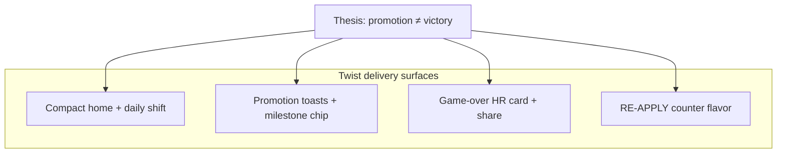

# Roadmap — Corporate Ladder

**Doc map:** [DOCS_INDEX.md](DOCS_INDEX.md) · **Scope:** [docs/mvp-scope.md](docs/mvp-scope.md) · **Visual tokens:** [DESIGN_SYSTEM.md](DESIGN_SYSTEM.md) · **Copy tone:** [.cursor/rules/satirical-copy.mdc](.cursor/rules/satirical-copy.mdc)

This roadmap is organized around four product pillars — **mechanics**, **graphics**, **animation**, and **satirical voice** — not feature lists alone. Each release should move at least one pillar forward without breaking the Lumberjack-style core loop ([snippet.txt](snippet.txt)).

---

## Product pillars (how work is prioritized)

| Pillar | What it means here | Primary files | Guardrail |
|--------|-------------------|---------------|-----------|
| **Mechanics** | Left/right climb, obstacles, energy, rank gates, spawn fairness | [`engine.ts`](apps/mini-app/src/game/engine.ts), [`constants.ts`](apps/mini-app/src/game/constants.ts) | No new control schemes; rank phases = progression |
| **Graphics** | Emoji-first arena, badges, HUD, contrast, office mood | [`template.ts`](apps/mini-app/src/template.ts), [`app.ts`](apps/mini-app/src/app.ts), [`style.css`](apps/mini-app/src/style.css) | Clarity over decoration; playfield stays readable |
| **Animation** | Tap feedback, telegraphs, death/promo juice, reduced-motion safe | [`effects.ts`](apps/mini-app/src/lib/effects.ts), [`style.css`](apps/mini-app/src/style.css) | 100–200ms micro-motions; no parallax clutter |
| **Satirical view** | HR framing, corporate jargon, shareable failure stories | [`constants.ts`](apps/mini-app/src/game/constants.ts), shell copy, [`apps/bot/main.py`](apps/bot/main.py) | Humor is the product; deadpan, not mean |

**Visual direction (locked):** *Funny cartoon* discipline on a *minimal arcade* playfield — sticker-like badges, emoji actor, office grid; satire in shell and game-over, clarity in the climb zone ([DESIGN_SYSTEM.md](DESIGN_SYSTEM.md) §1).

---

## Narrative thesis (plot beats without scope creep)

Corporate Ladder's core twist: **climbing the ladder is Sisyphean** — CEO is not a win state; **RE-APPLY FOR ROLE** is the real loop ([`template.ts`](apps/mini-app/src/template.ts)). Promotion subverts expectation; failure is an HR process, not generic game over.

**Delivery surfaces** (no new screens required):



**Implementation rule:** plot beats = **copy + timing + one visual beat**. Defer character systems to v1.9+ unless retention data says otherwise.

**Existing seeds to amplify** ([`constants.ts`](apps/mini-app/src/game/constants.ts)):

- Intern promo: *"Still an Intern. HR says your badge printer is 'in the queue.'"*
- CEO promo: *"Reached CEO. Strategic budget requests denied. Monocle unlocked. The board is watching."*
- Game-over framing: HR exit interview, termination detail + flavor quote

---

## Release train

| Version | Theme | Status | Tag when |
|---------|--------|--------|----------|
| **v1.5.0–v1.7.0** | Design, fairness, daily replays | **Shipped** (tags local) | Push tags to origin if not already |
| **v1.8.0** | Narrative beats + arena identity | **Shipped** (code + CHANGELOG) | Prod QA complete |
| **v1.8.1** | Telegram mobile + playability polish | **Shipped** (tag on origin) | [DEVICE_QA_v1.8.1.md](docs/DEVICE_QA_v1.8.1.md) manual sign-off |
| **v1.9.0** | Near-miss wince + Synergy Sprint (provisional) | **Planned** — confirm after [FF_TEST.md](docs/FF_TEST.md) | F&F review ~2026-06-14 |
| **v1.9+** | Data-informed juice | **Next product train** | After F&F metrics |
| **v1.1** | Platform (Legends, analytics, anti-cheat) | Deferred — explicit approval | See below |

---

## Shipped baseline (v1.5 → v1.8)

Inventory by pillar — do not regress without spec update.

### Mechanics

| Item | Notes |
|------|--------|
| Tap left/right, one rung per tap | Core loop unchanged |
| Obstacles: Meeting, Reorg, Deadline (`burnout`) + Coffee | Rank-gated: Intern → meetings; Manager → +reorgs; CEO → +deadlines |
| Energy drain + climb/coffee recovery | Pauses until first tap; 2s pause on promotion (v1.6) |
| Intern tutorial ramp | 22% obstacle rate first 12 rungs; forced coffee if none by rung 8 |
| Reorg fairness | Next rung (`rungs[1]`) does not swap during reorg ticks |
| Milestone progression | Intern @ 0y → Manager @ 10y → CEO @ 35y |
| Daily modifier resolver (v1.7) | UTC date → preset via [`daily-modifier.ts`](apps/mini-app/src/game/daily-modifier.ts) |
| Spawn weight overrides (v1.7) | 4 presets; engine reads `dailyModifier` |
| Reorg Week early reorg (v1.7) | `allowEarlyReorg`; fairness on `rungs[1]` unchanged |
| Dev override (v1.7) | `?dailyPreset=` + localStorage in DEV |

### Graphics

| Item | Notes |
|------|--------|
| Design-system shell | `btn-cl-*`, `card-light`, rank badges, Telegram `--cl-*` theme |
| Obstacle badges | Color-coded: red meeting, amber reorg, red deadline (v1.6 contrast) |
| HUD | Longevity, rank pill, energy meter, **milestone chip** (v1.6) |
| Game-over card | Performance review layout, REJECTED stamp, death cause row (v1.6) |
| Climb arena | Office grid, skyline silhouettes, ladder rails — intentionally minimal |
| Today's shift badge (v1.7) | [`template.ts`](apps/mini-app/src/template.ts) `#dailyShiftBlock` |
| Reorg Week grid tint (v1.7) | `office-grid-reorg-week` via `gridTintClass` |
| Meeting Monday reskins (v1.7) | Reply-All / Standup badges in [`createObstacleBadge`](apps/mini-app/src/app.ts) |
| Floor labels (v1.8) | Years band → office floor name on ladder rail |
| Rank props (v1.8) | Intern lanyard / Manager clipboard / CEO monocle on player |
| Reorg HUD strip (v1.8) | `ORG CHART UNSTABLE` amber bar when reorgs active |
| Game-over LB gap (v1.8) | `#leaderboardGapLine` — daily top vs current run |
| Bottom tap deck (v1.8.1+) | Visible h-28 TAP LEFT / TAP RIGHT in `#tapControlsBar` |
| Dynamic rung scaling (v1.8.1) | All 7 rungs fit inside play area |
| Compact home (v1.8.1) | Rule line above CTA; daily shift badge |
| Telegram native shell (v1.8.1) | Hide duplicate header; `BackButton`; sound FAB; safe-area padding |

### Animation

| Item | File / class | Purpose |
|------|--------------|---------|
| Climb pop | `climb-pop` | Tap confirmation |
| Rung advance | `rung-advance` | Upward progress |
| Reorg slide + telegraph | `reorg-slide-*`, `reorg-warning` | Fairness feedback |
| Safe-side hint (5 taps) | `safe-side-hint` | Onboarding (v1.8.1: extended from 3) |
| Next-rung warn | `next-obstacle-warn` | Threat read |
| Panic / stress | `player-panic`, `burnout-stress` | Low energy |
| Coffee / promo particles | `float-particle`, `promo-confetti` | Reward beats |
| Death sequence | `death-flash`, `shake-finite`, death emoji flash | Failure punch |
| Character micro-states | `idle-bob`, emoji flashes 🤤/😎 (v1.6) | Personality |
| Tap zone glow | `tap-zone-left/right:active` (v1.6) | Control feel |
| Reduced motion | `@media (prefers-reduced-motion: reduce)` | A11y |
| Shift badge entrance (v1.7) | `shift-badge-enter` | Home mount |
| Ticker emphasis (v1.7) | `ticker-shift-emphasis` | Non-standard shift days |
| Promo stamp (v1.8) | `promo-stamp` on promo overlay | Promotion beat |
| Death cause icon hold (v1.8) | `effects.ts` | Game-over punch |
| Heartbeat SFX (v1.8) | `audio.ts` under 15% energy | Low-energy tension |
| Tap-prompt bar (v1.8.1) | `#tapPrompt` below HUD | First-run guidance |

### Satirical view

| Surface | Implementation |
|---------|----------------|
| Failure flavor | `FAILURE_REASONS`, `FAILURE_BY_RANK` in constants |
| Promotion dialogue | `PROMOTION_DIALOGUES` + overlay + toasts |
| Game-over framing | HR exit interview, termination detail + flavor quote |
| Retry tips | `RETRY_TIPS` by `deathType` (v1.6) — actionable + deadpan |
| Share text | Performance review block in `app.ts` |
| Ticker foreshadow pool (v1.8) | Hidden on home; `NEWS_TICKER_HEADLINES` + 20% game-over payoff |
| RE-APPLY counter flavor (v1.8) | `REAPPLY_FLAVOR` tiers in `localStorage` |
| Manager nemesis line (v1.8) | VP of People Ops on Manager promotion |
| Intern fake-promo chain (v1.8) | Toasts at ~2y / ~5y / ~9.9y |
| Shift death flavor (v1.8) | `FAILURE_BY_SHIFT` per daily preset |
| CEO trap beat (v1.8) | Corner-office announcement at 35y |
| Employee badge | ACTIVE EMPLOYMENT, nickname, best career years |
| Shift labels + descriptions (v1.7) | Per preset in `daily-modifier.ts` |
| Share `Shift:` line (v1.7) | [`buildShareText`](apps/mini-app/src/app.ts) |
| In-run shift toast (v1.7) | First tap when modifier ≠ standard |

**Daily shift presets (rotate by UTC date):**

| Preset | Mechanic tweak | Satirical label |
|--------|----------------|-----------------|
| Standard | Default weights | Open Floor Plan |
| Meeting Monday | Higher meeting spawn weight | Meeting Monday |
| Coffee Break | Higher coffee spawn weight | Coffee Break |
| Reorg Week | Reorgs can appear before Manager rank | Reorg Week |

---

## v1.7.0 — Daily Replays (shipped)

**Goal:** Replay variety and daily retention **without** new screens, obstacle logic, or API changes. Pairs with existing **Daily leaderboard**.

**Ship gate (historical — all complete):**

- [x] Local smoke + deploy preflight green (`scripts/smoke-local.ps1`)
- [x] Production deploy + device QA (Meeting Monday + Reorg Week presets) — confirmed live 2026-05-31
- [x] Manual: share text includes shift name
- [x] Optional stretch: bot `/start` mentions today's shift ([`apps/bot/main.py`](apps/bot/main.py))
- [x] [CHANGELOG.md](CHANGELOG.md) cut `## [1.7.0]` from `[Unreleased]`
- [x] Tag `v1.7.0` per [DEPLOY.md](DEPLOY.md)

**Release gate:**

```bash
cd apps/mini-app && npm run lint && npm test && npm run build
```

---

## v1.8.0 — Narrative beats (shipped)

**Goal:** Make runs feel less samey via **satirical subversion and arena personality** — emoji-first, no sprite pipeline, no new control schemes. Primary ROI: **copy-first plot beats**; graphics/animation support clarity and juice.

### MoSCoW for v1.8

| Idea | Must | Should | Want | v1.8 |
|------|------|--------|------|------|
| Rotating ticker pool + foreshadow payoff | **✓** | | | **In** |
| Rank-up nemesis one-liner (Manager) | **✓** | | | **In** |
| RE-APPLY session counter + flavor | **✓** | | | **In** |
| Expand `FAILURE_BY_RANK` | | **✓** | | **In** |
| Modifier-specific death flavor (`FAILURE_BY_SHIFT`) | | **✓** | | **In** |
| Leaderboard gap on game over | | **✓** | | **In** |
| Floor labels on ladder rail | | **✓** | | **In** |
| Intern fake-promotion chain (2y/5y/9.9y toasts) | | **✓** | | **In** |
| CEO corner-office trap beat (copy-only announcement) | | **✓** | | **In** |
| Rank props, reorg HUD strip | | | **✓** | **Shipped** (Batch 2) |
| Near-miss wince, sticky-note decals | | | **✓** | Defer v1.9 |
| Synergy Sprint preset | | | | Defer v1.9 |
| Random decaf coffee / negative pickup | | | | **Out** |

---

### Batch 1 — Copy pack (effort S, ship first)

| Task | Detail | Files |
|------|--------|-------|
| Ticker pool | 10–15 headlines in constants; pick one on home mount | New `NEWS_TICKER_HEADLINES` in [`constants.ts`](apps/mini-app/src/game/constants.ts); wire in [`app.ts`](apps/mini-app/src/app.ts) |
| Foreshadow payoff | Optional: headline tagged with `deathType`; 20% chance flavor references active ticker on game-over | [`engine.ts`](apps/mini-app/src/game/engine.ts) `pickFlavorQuote` or `app.ts` `onGameOver` |
| Nemesis line | One VP/HR line on Manager promotion only — toast or overlay subtitle | [`constants.ts`](apps/mini-app/src/game/constants.ts), [`app.ts`](apps/mini-app/src/app.ts) `onRankChange` |
| RE-APPLY counter | `localStorage` run count; flavor line on game-over by tier (1 / 5 / 10+) | [`app.ts`](apps/mini-app/src/app.ts), new `REAPPLY_FLAVOR` in constants |
| Expand failures | +2–3 lines per rank in `FAILURE_BY_RANK` | [`constants.ts`](apps/mini-app/src/game/constants.ts) |
| Shift death flavor | `FAILURE_BY_SHIFT[presetId]` — 2 lines each; used when daily modifier active | [`constants.ts`](apps/mini-app/src/game/constants.ts), [`engine.ts`](apps/mini-app/src/game/engine.ts) |
| Intern promo chain | Milestone toasts at ~2y, ~5y, ~9.9y before real Manager promo | [`engine.ts`](apps/mini-app/src/game/engine.ts) or callback in `app.ts` |
| CEO trap beat | One-time toast at 35y: corner office secured; deadlines report to you | [`app.ts`](apps/mini-app/src/app.ts) `onRankChange` when rank === CEO |

**Copy rules:** [.cursor/rules/satirical-copy.mdc](.cursor/rules/satirical-copy.mdc) — no fourth-wall *"this is a game"*; CEO trap beat is **announcement only** (no new drain mechanic in v1.8 Must).

---

### Batch 2 — Arena feel (effort S–M)

| Task | Detail | Files |
|------|--------|-------|
| Floor labels | Ladder rail label from years band (e.g. Floor 12 — Open Office) | [`app.ts`](apps/mini-app/src/app.ts), [`template.ts`](apps/mini-app/src/template.ts) |
| Rank props | Intern lanyard / Manager clipboard / CEO monocle — CSS or emoji stack on player | [`app.ts`](apps/mini-app/src/app.ts), [`style.css`](apps/mini-app/src/style.css) |
| Reorg HUD strip | Amber micro-bar when reorgs active: ORG CHART UNSTABLE | [`template.ts`](apps/mini-app/src/template.ts), [`app.ts`](apps/mini-app/src/app.ts) |
| Promotion stamp | Rotate-in PROMOTED beside promo overlay | [`effects.ts`](apps/mini-app/src/lib/effects.ts), [`style.css`](apps/mini-app/src/style.css) |
| Heartbeat SFX | Under 15% energy | [`audio.ts`](apps/mini-app/src/game/audio.ts) |
| Death cause icon hold | 400ms+ hold on game-over card | [`effects.ts`](apps/mini-app/src/lib/effects.ts) |

Keep all new motion behind `prefers-reduced-motion` ([`effects.ts`](apps/mini-app/src/lib/effects.ts) pattern).

---

### Batch 3 — Retention hook (effort S, needs API)

| Task | Detail | Files |
|------|--------|-------|
| Leaderboard gap | Game-over line: *"#1 is X.Xy ahead"* — fetch daily LB top vs current run | [`app.ts`](apps/mini-app/src/app.ts), [`lib/api.ts`](apps/mini-app/src/lib/api.ts), [`packages/api/app/routes/leaderboard.py`](packages/api/app/routes/leaderboard.py) if new field needed |

**Stretch (v1.8 or v1.9):** sticky-note decals, near-miss wince, modifier-specific `RETRY_TIPS`, soft drain cap after 20y.

---

### v1.8 definition of done

- [x] Batch 1 copy pack merged; no new obstacle logic
- [x] Ticker rotates; at least one foreshadow payoff path tested manually
- [x] RE-APPLY counter persists across sessions (localStorage)
- [x] `npm run lint && npm test && npm run build`; verifier on user-facing work
- [x] [CHANGELOG.md](CHANGELOG.md) `[Unreleased]` + tag `v1.8.0` (local; deploy after production QA)

---

## v1.8.1 — Telegram mobile polish (code done — ship gate)

**Goal:** Playability and native Telegram feel on real devices — no new mechanics, screens, or API.

**Ship gate checklist:**

- [x] `scripts/smoke-local.ps1` green
- [x] Redeploy Vercel + Railway bot (bot Docker fix) — prod bundle verified 2026-05-31
- [ ] Device QA: iOS + Android — [docs/DEVICE_QA_v1.8.1.md](docs/DEVICE_QA_v1.8.1.md)
- [x] Cut `## [1.8.1]` in CHANGELOG; tag `v1.8.1` (local); push tag after device QA + redeploy
- [x] Verifier pass — code + automated gates ([.cursor/agents/verifier.md](.cursor/agents/verifier.md)); device QA step 9 pending

**Release gate:**

```bash
cd apps/mini-app && npm run lint && npm test && npm run build
```

**Scope (from CHANGELOG `[Unreleased]`):**

- Prompt Anatomy footer — compact link
- Telegram mobile shell — hide duplicate header; native `BackButton`; floating sound FAB; safe-area / `viewport-fit=cover`
- Gameplay visibility — overlay tap zones; dynamic rung scaling; tap-prompt bar; compact home (ticker hidden on home); safe-side hints for 5 taps
- Viewport QA — 65% play-area ratio; seven-rung fit check
- Bot Docker fix — skip repo-root `.env` lookup when `main.py` runs from `/app`

---

---

## v1.9.0 — Near-miss wince + Synergy Sprint (provisional — confirm after F&F)

**Goal:** Juice and session variety without new screens or control schemes. **Confirm or cut** after [docs/FF_TEST.md](docs/FF_TEST.md) review (~2026-06-14).

| Item | Must | Notes |
|------|------|-------|
| Near-miss wince | **✓** | v1.8 stretch; `effects.ts` + CSS; reduced-motion safe |
| Synergy Sprint preset | **✓** | 60s timer mode flag; new daily-modifier preset or run flag |
| Sticky-note decals | | Cut unless F&F says arena flat |
| Antagonist emoji NPC | | Cut unless F&F says samey |

**Out for v1.9:** v1.1 analytics, Legends/Friends LB, anti-cheat — explicit approval required.

**Definition of done (when implementing):**

- [ ] F&F decision recorded in FF_TEST.md
- [ ] `[Unreleased]` CHANGELOG entries
- [ ] `npm run lint && npm test && npm run build`; verifier
- [ ] No new obstacle logic; match [snippet.txt](snippet.txt)

---

## v1.9+ / v2.0 — Data-informed (Want)

Build only if friends-and-family or v1.1 analytics show retention plateau.

| Item | Pillars | Trigger |
|------|---------|---------|
| Server-seeded daily + modifier LB | Mechanics + platform | Daily DAU &gt; threshold |
| Antagonist beat (emoji NPC) | Graphics + satire | Sessions still feel samey after v1.8 Batch 1+2 |
| Synergy Sprint preset | Mechanics + UI | 60s fixed timer — mode flag, not level select |
| 2–3 mode presets (Endless / Sprint / Today) | Mechanics + UI | Not a 5-level campaign |
| Vector mascot | Graphics + animation | Art bandwidth; emoji ceiling hit |
| Full level select / campaign map | All | **Avoid** unless product pivot |
| Rejected: decaf trap, campaign map | — | See [Explicitly out of scope](#explicitly-out-of-scope) |

---

## v1.1 — Platform (deferred — explicit approval)

From [docs/mvp-scope.md](docs/mvp-scope.md). Not a substitute for v1.7/v1.8 game juice.

- All-time / Legends leaderboard tab
- Friends leaderboard
- Server-side replay validation (anti-cheat)
- Analytics (session length, share rate, retention)
- Admin dashboard

**Recommendation:** Lightweight analytics is **Should** before large v2 bets; v1.8.1 live — measure via friends-and-family before v2 bets.

---

## Deploy gate (production — v1.5 → v1.8.1)

| Step | Status |
|------|--------|
| Production Mini App on Vercel | [x] |
| API health check ok | [x] |
| Bot `/start` opens Mini App | [x] |
| Score on Daily leaderboard | [x] |
| Telegram iOS + Android QA (v1.6–v1.8) | [x] |
| Tags v1.5.0–v1.8.0 (local; push tags if not on origin) | [x] |
| v1.8.1 redeploy | [x] |
| v1.8.1 device QA (manual) | [ ] — [docs/DEVICE_QA_v1.8.1.md](docs/DEVICE_QA_v1.8.1.md) |

**Deploy checklist:** [DEPLOY.md](DEPLOY.md) · **Progress:** [docs/DEPLOY_STATUS.md](docs/DEPLOY_STATUS.md)

```bash
# After v1.8.1 device QA
git tag v1.8.1
git push origin main --tags
```

### Friends-and-family test (post v1.8.1)

Run **1–2 weeks** after v1.8.1 tag. Tracker: [docs/FF_TEST.md](docs/FF_TEST.md). Use results to inform v1.9 Must/Should cuts — not v1.8 backlog (complete).

**Discoverability (not SEO):** Telegram-first distribution — bot + shares, not Google. Optional Phase 0 link-preview metadata during F&F; Phase 1 ecosystem blurb on Prompt Anatomy site after F&F review. Full plan: [docs/discoverability-plan.md](docs/discoverability-plan.md).

1. Share bot with 5–10 testers  
2. Track: session length (30–90s target), games/user, share rate, daily return  
3. Log issues via [.github/ISSUE_TEMPLATE/bug_report.md](.github/ISSUE_TEMPLATE/bug_report.md)  
4. Review metrics → pick **1–2 v1.9 items** from [v1.9+](#v19--v20--data-informed-want) (avoid v1.1 platform without explicit approval)

**v1.9 candidate priority (from existing backlog):**

| Priority | Item | Trigger |
|----------|------|---------|
| Should | Near-miss wince | v1.8 stretch leftover |
| Should | Synergy Sprint preset | F&F wants shorter sessions |
| Want | Sticky-note decals | Arena still feels flat |
| Want | Antagonist emoji NPC | Runs feel samey after v1.8 |
| Platform | Lightweight analytics | Need data before v2 — v1.1 approval required |

---

## Explicitly out of scope

Per [docs/mvp-scope.md](docs/mvp-scope.md) — do not slip into roadmap without product decision:

- Virtual currency, skins shop, clans, quests, NFTs  
- Complex rank tree (Director, VP, …)  
- New obstacle logic (both sides lethal, moving hazards, hold-to-dodge)  
- Separate antagonist AI / combat  
- Heavy parallax or full arena redesign  
- Breaking fourth wall (*"this is a game"*) — per [satirical-copy.mdc](.cursor/rules/satirical-copy.mdc)  
- Random negative coffee / decaf trap — frustrating, not funny  

---

## Pillar checklist for any future task

Before merging gameplay or UI work, ask:

1. **Mechanics** — Does it preserve left/right clarity and fair telegraphs?  
2. **Graphics** — Is the next rung still readable at a glance on mobile?  
3. **Animation** — Is it &lt;200ms, optional under reduced motion?  
4. **Satire** — Does copy sound like HR/bureaucracy, not generic game over text?  
5. **Narrative** — Does this subvert a corporate expectation (promotion, retry, ticker) without new screens or mechanics?

If any answer is no, cut scope or defer.

---

## Related docs

| Doc | Use when |
|-----|----------|
| [snippet.txt](snippet.txt) | Mechanics canon |
| [primal.txt](primal.txt) | Product narrative |
| [DESIGN_SYSTEM.md](DESIGN_SYSTEM.md) | Shell tokens and utilities |
| [CHANGELOG.md](CHANGELOG.md) | Shipped vs planned |
| [.cursor/agents/verifier.md](.cursor/agents/verifier.md) | Pre-tag QA |
