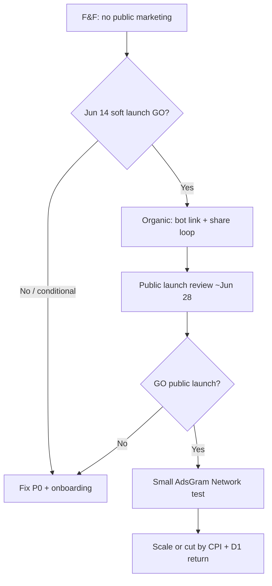

# Ads & Acquisition Plan — Corporate Ladder

**Status:** Approved approach · **Doc map:** [DOCS_INDEX.md](../DOCS_INDEX.md)  
**Companion:** [discoverability-plan.md](discoverability-plan.md) (organic growth) · **Monetization setup:** [DEPLOY.md](../DEPLOY.md) § AdsGram revive

Corporate Ladder has **two separate ad surfaces**. Do not conflate them:

| Lane | What it is | Platform | Current gate |
|------|------------|----------|--------------|
| **Acquisition** | Pay to bring **new players** to `@CorporateLadderBot` | AdsGram campaigns, channel posts, press | **Deferred** — public launch review ~2026-06-28 |
| **In-app monetization** | **Rewarded** ad on qualifying game-over → one revive per run | AdsGram Reward block (`revive-game-over`) | **Optional** — test with env flags; live block after moderation |

**Primary growth loop** (unchanged — see [discoverability-plan.md](discoverability-plan.md)):

```
@CorporateLadderBot /start → Mini App → play → share → friend opens bot
```

Paid acquisition is a **scale lever after retention is proven**, not a substitute for F&F signal.

---

## Current phase (2026-06)

| Milestone | Marketing rule | Source |
|-----------|----------------|--------|
| F&F window (→ 2026-06-14) | **No public marketing** | [ROADMAP.md](../ROADMAP.md) Status, [FF_EXECUTION.md](FF_EXECUTION.md) |
| Soft launch GO (Jun 14) | F&F expansion only — **not** paid acquisition | [FF_REVIEW_2026-06-14.md](FF_REVIEW_2026-06-14.md) §C, §F |
| Public launch review (~2026-06-28) | First decision point for paid ads + wide channel posts | [ROADMAP.md](../ROADMAP.md) Status |

**Jun 10 pre-read** ([FF_METRICS_2026-06-10.md](FF_METRICS_2026-06-10.md)): externals with ≥3 runs **3/6** (target ≥6/8); onboarding churn on first run. **Do not buy traffic until first-session retention improves.**

---

## Acquisition — AdsGram campaign types

Operator dashboard: [traffic.adsgram.ai/campaigns](https://traffic.adsgram.ai/campaigns) (advertiser / traffic side).  
In-app partner blocks: [partner.adsgram.ai](https://partner.adsgram.ai) (publisher / Reward block — see [DEPLOY.md](../DEPLOY.md)).

| AdsGram type | Inventory | Fit for Corporate Ladder | When to use |
|--------------|-----------|------------------------|-------------|
| **Telegram Network** | Mini Apps + alternative Telegram clients | **Best acquisition fit** — users already in TMA context; CTA → bot / `startapp` | **First paid test** after public launch GO |
| **Telegram Native** | Sponsored posts in channels and bots | Medium — needs satire/office/gaming/casual channel list; copy must match [satirical-copy](../.cursor/rules/satirical-copy.mdc) | Small budget test after Network baseline CPI |
| **Telegram Ads β** | Official Telegram Ads (large public channels) | Weakest for cold game launch — broad reach, higher spend, less game intent | Only with data from Network/Native; not first spend |

**Default first campaign (post-GO):** Telegram Network → landing on `https://t.me/CorporateLadderBot` (not raw mini-app URL — same rule as F&F recruitment in [FF_TEST.md](FF_TEST.md)).

---

## Organic — own Telegram channel / supergroup

**Surfaces:** Prompt Anatomy ecosystem channel or supergroup (see [FF_TEST.md](FF_TEST.md) group launch notes). This is **free distribution**, not AdsGram.

| Phase | Channel action | Tone |
|-------|----------------|------|
| **F&F (now)** | Direct bot link to invited testers only; no blast | "Soft launch — your feedback shapes the game" |
| **Post F&F GO** | Optional soft post to warm audience; +5 F&F testers via DM/link | Same; no paid boost |
| **Phase 1 discoverability** | Short post + bot link if F&F metrics positive | One paragraph; link to PA site blurb when live |
| **Post ~Jun 28 public launch GO** | Full announcement; reuse [docs/assets/marketing/](assets/marketing/) carousel | Satirical HR framing; CTA = bot |

**Assets:** `npm run capture:marketing` → [docs/assets/marketing/README.md](assets/marketing/README.md).

---

## Go / no-go gates (paid acquisition)

All must pass before **any** paid spend. Track via [FF_TEST.md](FF_TEST.md) / `python scripts/ff-metrics.py` / Supabase.

| # | Gate | Target |
|---|------|--------|
| 1 | `submit_pipeline_ok` | `true` |
| 2 | DEVICE_QA v2.0 | Signed ([DEVICE_QA_v2.0.md](DEVICE_QA_v2.0.md)) |
| 3 | Externals ≥3 runs | ≥6/8 (or revised cohort size with same ratio) |
| 4 | First-run churn | No dominant "1 run and quit" without onboarding fix |
| 5 | Share signal | Qualitative share attempts or paste validated in Telegram |
| 6 | Public launch review | **GO** vote recorded (~2026-06-28) |
| 7 | Creative + entry | Bot link, OG image deployed, [discoverability Phase 0](discoverability-plan.md) green |

**If gates fail:** invest in product (onboarding walkthrough, v1.9 juice per [ROADMAP.md](../ROADMAP.md) F&F decision tree) — **not** ads.

---

## Suggested timeline



| Date | Action | Cost |
|------|--------|------|
| Now → 2026-06-14 | F&F recruitment, share loop, BotFather polish | $0 |
| 2026-06-14 → 2026-06-28 | Monitor metrics; Phase 1 PA site blurb if signal positive | $0 |
| ~2026-06-28 | Public launch readiness review | $0 |
| Post-GO week 1 | AdsGram **Telegram Network** pilot (suggest $50–150 cap) | Paid |
| Post-GO month 1 | Native channel tests if Network CPI acceptable | Paid |
| Later | Telegram Ads β, press, Product Hunt — [discoverability Phase 2](discoverability-plan.md) | Paid / ops |

**Pilot KPIs (operator — not in mini-app v1):** cost per bot `/start`, % with ≥1 submitted run, % with ≥3 runs in 7 days, share mentions in feedback.

---

## In-app monetization (Reward block) — separate track

Already shipped in repo — **not** acquisition.

| Item | Detail |
|------|--------|
| Feature | Optional **Mandatory HR Training** rewarded revive on qualifying deaths |
| Env | `VITE_ADSGRAM_REVIVE_ENABLED`, `VITE_ADSGRAM_BLOCK_ID` — [DEPLOY.md](../DEPLOY.md) |
| Rules | One revive per run; no forced interstitials; no virtual currency — [mvp-scope.md](mvp-scope.md) |
| Moderation | AdsGram Reward block `revive-game-over` via @adsgramsupport |

**Recommendation:** keep revive **off or ad-free test mode** during F&F if first-run onboarding is still weak — ads before the "aha" run hurt retention more than they earn.

---

## KISS / Marry / Kill

### KISS — do these (current stage)

- Bot-link F&F recruitment ([FF_EXECUTION.md](FF_EXECUTION.md) Phase E)
- Share loop + OG preview ([discoverability-plan.md](discoverability-plan.md) Phase 0)
- Record public launch review date (~2026-06-28)
- Prepare marketing screenshots (`capture:marketing`) before wide channel post

### Marry — keep

- Retention metrics over vanity installs ([mvp-scope.md](mvp-scope.md) success metrics)
- `@CorporateLadderBot` as sole paid-ad landing (not `promptanatomy.lol` cold)
- Satirical copy in any channel or ad creative ([satirical-copy.mdc](../.cursor/rules/satirical-copy.mdc))

### Kill — do not do (this stage)

- Paid acquisition during F&F window
- Forced interstitials or banner ads in mini-app
- Buying traffic before ≥6/8 externals complete 3-run script
- Telegram Ads β as first spend without Network baseline
- Marketing-site layout inside `apps/mini-app` ([DESIGN_SYSTEM.md](../DESIGN_SYSTEM.md))

---

## Related documents

- [discoverability-plan.md](discoverability-plan.md) — organic Telegram + shell SEO
- [FF_EXECUTION.md](FF_EXECUTION.md) · [FF_TEST.md](FF_TEST.md) · [FF_REVIEW_2026-06-14.md](FF_REVIEW_2026-06-14.md) — F&F gates
- [FF_METRICS_2026-06-10.md](FF_METRICS_2026-06-10.md) — pre-review retention snapshot
- [DEPLOY.md](../DEPLOY.md) — AdsGram Reward env vars
- [docs/assets/marketing/README.md](assets/marketing/README.md) — channel / ad creative
- [ROADMAP.md](../ROADMAP.md) — release train + public launch gate
